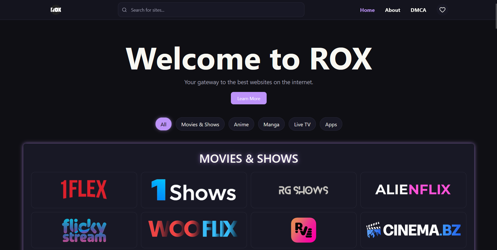

# ROX

A fast, minimal web portal to access curated platforms across movies, anime, manga, live TV, and apps — all in one place.

---

##  Live Demo

https://rozuwan.github.io/Rox/index.html

---

##  Preview



---

##  Features

* 🔍 Real-time search filtering
* 🗂️ Category-based navigation
* 🎨 Clean & responsive UI
* ⚡ Lightweight and fast

---

##  Tech Stack

* HTML
* Tailwind CSS
* JavaScript
* Flowbite
* Vite (build & bundling)

---

##  Project Structure

```bash
ROX/
│── index.html
│── about.html
│── dmca.html
│── src/
│   ├── main.js
│   └── style.css
│── public/
│── vite.config.js
│── dist/ (generated)
```

---

## ⚠️ Disclaimer

ROX is a directory platform and does not host any content.
All links point to third-party websites.

---

## ⭐ Support

If you like this project, consider giving it a ⭐ on GitHub!
